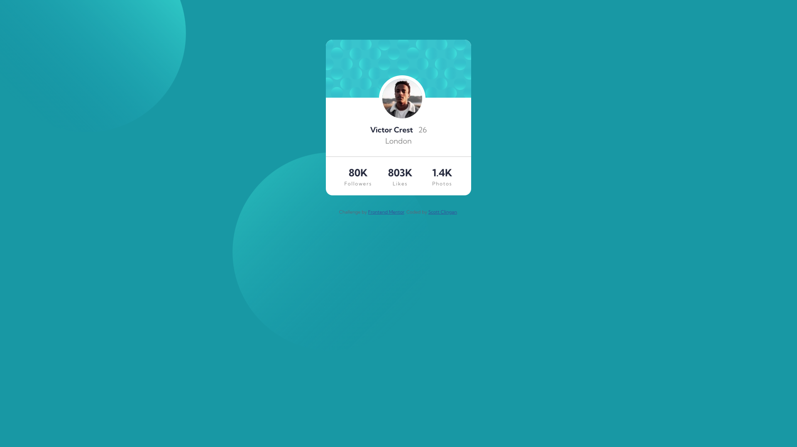

# Frontend Mentor - Profile card component solution

This is a solution to the [Profile card component challenge on Frontend Mentor](https://www.frontendmentor.io/challenges/profile-card-component-cfArpWshJ). Frontend Mentor challenges help you improve your coding skills by building realistic projects. 

## Table of contents

- [Overview](#overview)
  - [The challenge](#the-challenge)
  - [Screenshot](#screenshot)
  - [Links](#links)
- [My process](#my-process)
  - [Built with](#built-with)
  - [What I learned](#what-i-learned)
  - [Continued development](#continued-development)
  - [Useful resources](#useful-resources)
- [Author](#author)
- [Acknowledgments](#acknowledgments)

## Overview

### The challenge

- Build out the project to the designs provided

### Screenshot

### Links

- Solution URL: (https://github.com/sclingan/profile-card-component-main)
- Live Site URL: (https://sclingan.github.io/profile-card-component-main)

## My process

### Built with

- Semantic HTML5 markup
- CSS custom properties
- Flexbox
- CSS Grid
- Mobile-first workflow
- [React](https://reactjs.org/) - JS library

### What I learned

I had a hard time trying to figure out how to have two different
background images and how to position them according to design. I 
also think my solution to the list items could have been done better, but for now it works.

### Continued development

I want to come back to this challenge and redo the list items, to see if I can do it a better way. Using Grid or Flexbox without using two lists.

### Useful resources

- (https://www.w3schools.com/) - A great place to learn all things web dev!
- (https://developer.mozilla.org/) - An amazing resource to keep
up to date.

## Author

- Frontend Mentor - [@sclingan](https://www.frontendmentor.io/profile/sclingan)

## Acknowledgments

Thanks again to Frontend Mentor for a great challenge!

